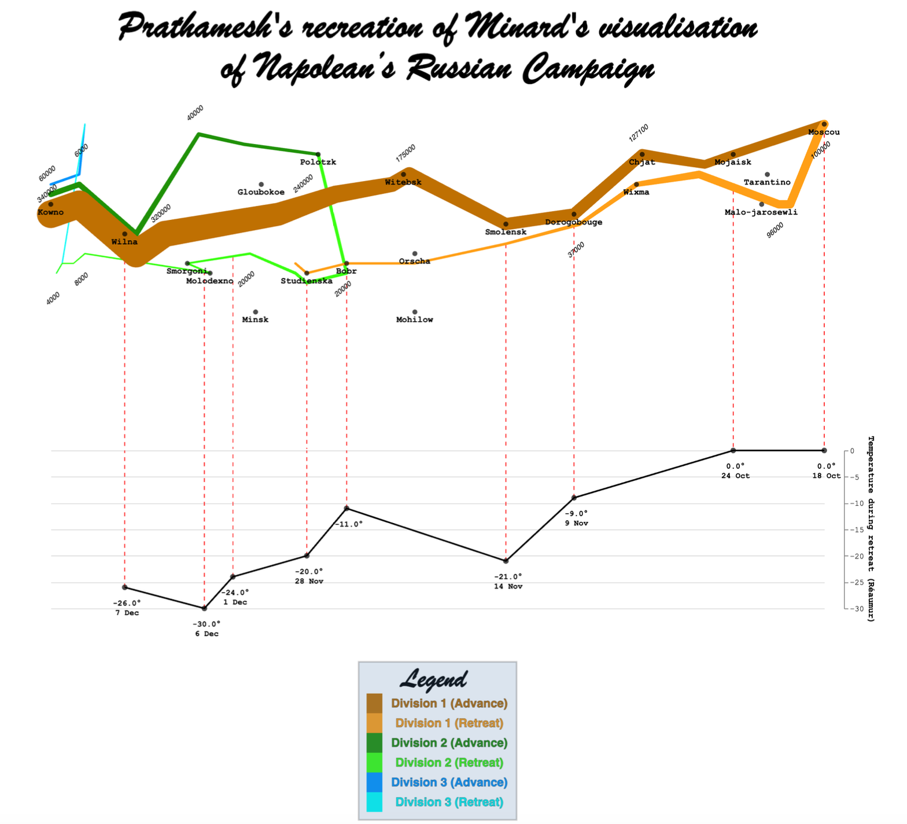

# Recreating Minard's visualization of Napolean's Russian Campaign

The repository contains my Python code to recreate Minard's visualization of Napolean's Russian Campaign which can be found [here](https://datavizblog.com/2013/05/26/dataviz-history-charles-minards-flow-map-of-napoleons-russian-campaign-of-1812-part-5/). I added my own twist to the original and details about my implementation are noted in my [report](report.pdf).

# Requirements
I used Python 3.9 for this visualization. The packages used for this project can be found in the virtual environment. You can activate it by running the command below for Linux/MacOS:

```
source venv/bin/activate
```


# How to run
```
python3 main.py
```

# Final visualization

